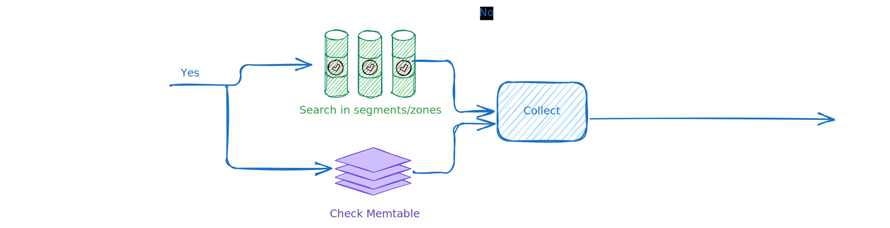

# Query and Replay

## Overview

SnelDB reads come in two flavors:

- `QUERY`: filter one event type by predicates, time, and optional `context_id`; may span shards.
- `REPLAY`: stream all events for one `context_id` (optionally one type) in original append order; single shard.

Both use the same internals as the write path: in‑memory MemTable, on‑disk immutable segments, per‑segment zones, and compact per‑field filters.

## When to Use Which

- Use `QUERY` for analytics, debugging slices, and ad‑hoc filters across many contexts.
- Use `REPLAY` to rebuild state or audit the exact sequence for one context.

### Examples

- QUERY

  - Investigate: "All `order_created` over $100 in the last 24h across all users"
  - Dashboard: "Errors by type this week"
  - Debug: "Sessions with `status = 'pending'` and `retries > 3`"

- REPLAY
  - Operational debugging (incident timeline)
    ```sneldb
    REPLAY system_event FOR host-123 SINCE "2024-05-01T00:00:00Z"
    ```
  - Auditing/compliance (full account trail)
    ```sneldb
    REPLAY FOR account-42 SINCE "2024-01-01T00:00:00Z"
    ```
  - ML pipelines (rebuild a customer’s transaction sequence)
    ```sneldb
    REPLAY transaction FOR user-456 SINCE "2023-01-01T00:00:00Z"
    ```
  - Product journey (single user or session in order)
    ```sneldb
    REPLAY FOR user-123
    ```

## Command Cheatsheet

```sneldb
QUERY <event_type> [FOR <context_id>] [SINCE <ts>] [WHERE <expr>] [LIMIT <n>]
```

```sneldb
REPLAY [<event_type>] FOR <context_id> [SINCE <ts>]
```

More examples: [Query](../commands/query.md) and [Replay](../commands/replay.md)

## How It Works

### QUERY (step‑by‑step)

1. Parse and validate inputs.
2. Plan shard tasks (fan‑out unless narrowed by `context_id`).
3. Per shard, scan MemTable and pick relevant segments.
4. Prune zones by time and per‑field filters; read only needed columns.
5. Evaluate predicates and apply `WHERE` condition.
6. Merge shard results; apply global `LIMIT` if set.

### REPLAY (step‑by‑step)

1. Parse and validate inputs.
2. Route to the shard owning the `context_id`.
3. Scan MemTable and relevant segments for that context.
4. Apply optional `event_type` and `SINCE` filters.
5. Stream events in original append order.

See the diagram:



## What You Get

- **Visibility**: fresh writes are visible from `MemTable` before flush.
- **Ordering**: `REPLAY` preserves append order (single shard). `QUERY` has no global ordering unless you explicitly sort at merge (costly) or scope the query narrowly.
- **LIMIT** (`QUERY`): short‑circuit per shard when possible; always cap globally during merge.

## Performance Tips

- **Prune early**: favor `event_type`, `context_id`, and `SINCE` to skip zones fast.
- **Shard wisely**: more shards increase scan parallelism but cost more on fan‑out.

## Tuning

- `events_per_zone`: smaller zones = better pruning, more metadata; larger zones = fewer skips, less metadata.
- `flush_threshold`: affects how much is in memory vs on disk, and segment cadence.
- Shard count: match to CPU and expected concurrency.

## Invariants

- Immutability: events and segments are never edited in place.
- Single‑shard replay: each `context_id` maps to exactly one shard.
- Schema validity: stored payloads conform to their event type schema.
- Atomic publication: new segments become visible all‑or‑nothing.

## Further Reading

- [Read flow overview](./storage_engine.md)
- [Segments and zones](../architecture/segments_zones.md)

SnelDB’s read path is simple to reason about: prune aggressively, read only what you need, and merge efficiently—whether you’re slicing across many contexts or replaying one.
