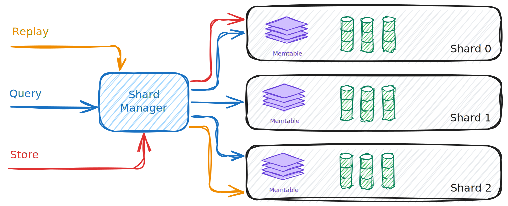

# Sharding

## What it is

Sharding is how SnelDB scales ingestion and keeps per-context replay efficient. Instead of one big pipeline, the system runs multiple shard workers side by side. Each `context_id` is deterministically mapped to a shard, so all events for that context live together.

## Core pieces

- Shard Manager — owns all shards and routes work to them by hashing `context_id`.
- Shard (worker) — long‑lived task that owns a WAL, active/passive MemTables, a flush queue, and the shard’s segment list. Processes Store, Query, Replay, and Flush messages.
- Messages — typed messages delivered to each shard: Store, Query, Replay, Flush.
- Backpressure — each shard has a bounded mailbox; when it fills, senders wait. Hot shards slow down independently without affecting others.

## How it works

- Startup

  - The manager creates `N` shards (configurable) and starts one worker per shard.
  - Each shard ensures its storage directories exist, recovers its MemTable from its WAL, loads existing segment IDs, and starts background services (flush, compaction).

- Store

  - Hash `context_id` → pick shard → send Store.
  - The shard appends to its WAL, updates the in‑memory MemTable, and, when the MemTable reaches its threshold, rotates it to a passive buffer and enqueues a flush.

- Query

  - Broadcast to all shards. Each shard scans its in‑memory state and on‑disk segments and returns matches. Results are merged.

- Replay

  - Single‑shard. The manager routes to the shard that owns the `context_id`. The shard streams events in order for that context.

- Flush
  - Manual `Flush` is broadcast to all shards. Each shard rotates its active MemTable and enqueues a flush to create a new segment.
  - Automatic flush also occurs when a shard’s MemTable reaches its configured threshold during ingestion.

## Why this design

- **Locality**: all events for a `context_id` stay on one shard → fast, single‑shard replay.
- **Parallelism**: shards work independently → ingestion and queries scale with cores.
- **Isolation**: hot shards apply backpressure locally without stalling the whole system.
- **Simplicity**: shards don’t coordinate directly; only query results are merged.

## Invariants

- Same `context_id` → always the same shard.
- Within a shard, event order per `context_id` is preserved.
- Shards never share mutable state; cross‑shard communication happens via message passing and result merging.

## Operational notes

- Number of shards controls parallelism; increase to utilize more CPU cores.
- Flush threshold tunes memory usage vs. write amplification; lower values flush more often.
- On startup, shards recover from their WALs before serving traffic; compaction runs in the background to control segment growth.

## Further Reading

- A deep dive into WAL or flush internals (see [Storage Engine](./storage_engine.md)).
- Query planning details (see [Query & Replay](./query_replay.md)).
- Compaction policies (see [Compaction](./compaction.md)).

Sharding is the concurrency backbone: it divides the work, keeps replay cheap, and prevents overload by applying backpressure shard by shard.
