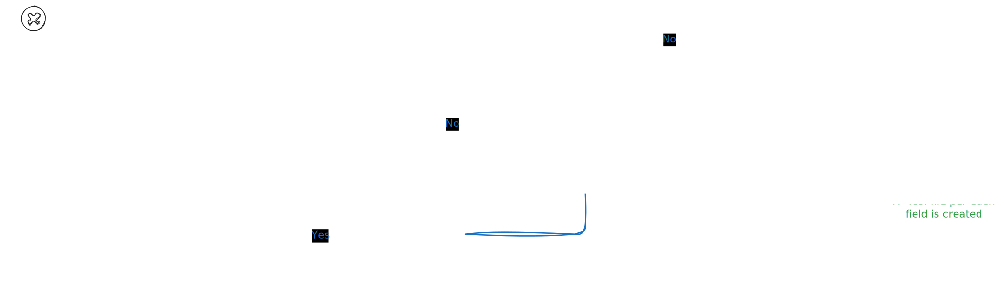
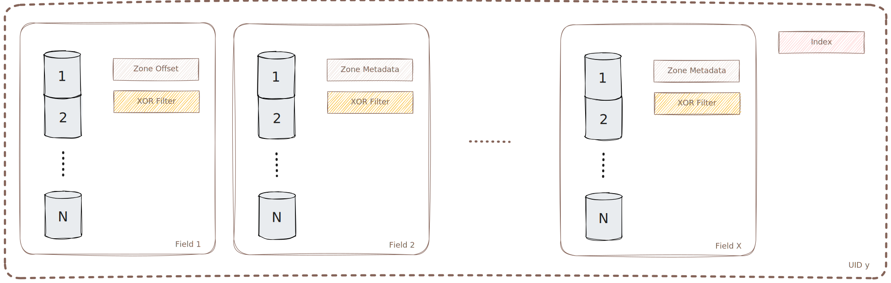

# Storage Engine

## Overview

The storage engine turns incoming events into durable, immutable data you can query quickly. It’s built around append-only writes, in-memory buffering, and on-disk segments that are efficient to scan and easy to skip.

## Core Components

- **WAL (write-ahead log)**: Per-shard durability log. Every accepted event is appended here first.
- **MemTable**: In-memory buffer for recent events. Fast inserts; swapped out when full.
- **Flush worker**: Converts a full MemTable into an immutable on-disk segment in the background.
- **Segments**: On-disk building blocks (columns, zone metadata, filters, lightweight indexes).
- **Compactor** (covered later): Merges small segments into larger ones to keep reads predictable.

## Write Path (At a Glance)

1. Validate payload against the event type schema.
2. Append to the WAL (durability point).
3. Apply to the MemTable (fast in-memory structure).
4. When the MemTable hits a threshold, swap it out and enqueue a background flush.
5. Flush worker writes a new segment and publishes it atomically.

See the diagram below:



## Write Path (In Depth)

### 0) Validate the event

- **What**: Check the incoming payload against the registered schema for its `event_type`.
- **Why**: Ensures only well-formed data enters the system so downstream files and indexes remain consistent.

Example:

```json
{
  "timestamp": 1700000000,
  "event_type": "signup",
  "context_id": "user-42",
  "payload": { "plan": "pro", "country": "US" }
}
```

Equivalent command:

```sneldb
STORE signup FOR user-42 PAYLOAD {"plan":"pro","country":"US"}
```

Validation ensures required fields exist and types are correct (for example, the `event_type` is known and a "plan" is provided in the payload).

### 1) Append to the WAL (durability point)

- **What**: Append the validated event to the per-shard Write-Ahead Log (WAL).
- **Why**: Once the append returns, the event will survive a crash. On restart, the system replays WAL entries to rebuild in-memory state and complete any interrupted flushes.
- **Notes**:
  - WAL records are lightweight, line-oriented appends (JSON-serialized per line).
  - WAL files rotate in sync with the MemTable flush threshold (`engine.flush_threshold`), so replay windows are bounded by flush points. After a successful flush, older WAL files up to that cutoff can be pruned.
  - Behavior is tunable via config: `[wal] enabled, dir, buffered, buffer_size, flush_each_write, fsync, fsync_every_n` and `[engine] flush_threshold`.

Crash safety example:

- If the process crashes after the WAL append but before the event hits memory, recovery will re-insert it into the MemTable on startup.

### 2) Insert into the MemTable (fast in-memory apply)

- **What**: Place the event into the in-memory, append-friendly, queryable buffer (MemTable).
- **Why**: Absorb writes in memory to batch them into large, sequential segment writes (avoids random I/O), maintain backpressure with bounded memory, and maximize ingest throughput. As a secondary benefit, new events are immediately visible to queries.
- **Behavior**:
  - The MemTable is sized by `flush_threshold` (config). When it reaches capacity, it triggers a swap and a background flush.
  - Inserts are grouped by context so the flusher can scan them quickly.

Small example:

- `flush_threshold = 4`
- Incoming events (in order): A, B, C, D, E
  - A, B, C, D go into the active MemTable. After D, the MemTable is full.
  - A background flush is enqueued for these four; a fresh MemTable becomes active.
  - E enters the new MemTable immediately (no blocking on the background flush).

### 3) Swap and enqueue a background flush

- **What**: When the active MemTable is full, it’s atomically swapped for a fresh, empty one, and the full snapshot is queued for flushing.
- **Why**: Writers remain responsive (no long I/O in the foreground) and the system maintains bounded memory.
- **Details**:
  - The passive MemTable (now immutable) is handed off to the flush worker.
  - Writes proceed into the newly created active MemTable.

### 4) Flush worker writes a new immutable segment

- **What**: The background worker turns the passive MemTable into an on-disk segment directory (for example, `segment-00042/`).
- Inside the segment:
  - **Column files**: One file per field, optimized for sequential appends and later memory-mapped (mmap) access. Naming: `<uid>_<field>.col`. Example: `u01_timestamp.col`, `u01_event_type.col`, `u01_context_id.col`, `u01_plan.col`, `u01_country.col`. Where `<uid>` is defiened per event type.
  - **Zone metadata**: Per-zone min/max timestamps, row ranges, and presence stats for pruning.
  - **Filters**: Compact structures (for example, XOR filters) for “definitely-not-here” checks before touching columns.
  - **Offsets/Index**: Jump tables and per-field offsets (`.zf` files) to locate values efficiently.
- **Publication**: Segment creation is atomic at the directory level; once complete, readers can discover and scan it.

See the diagram below:



Sizing example:

- `flush_threshold = 32_768`
- `events_per_zone = 2_048`
- A full flush of 32,768 events creates exactly 16 zones. Each zone has its own metadata and contributes field values to the filter files. Larger `events_per_zone` values reduce metadata overhead but offer coarser pruning; smaller values increase pruning precision at the cost of more metadata.

### 5) Cleanup and WAL compaction

- **What**: After a successful flush, the system can prune or rotate old WAL files up to a cutoff corresponding to flushed data.
- **Why**: Keeps recovery time short and disk usage bounded.

### End-to-end write example

1. Client sends `STORE signup ...` with a valid payload.
2. The engine validates the event against the `signup` schema.
3. The event is appended to the WAL for shard 3 (durability).
4. The event is inserted into shard 3’s active MemTable.
5. When the MemTable reaches `flush_threshold`, it is swapped and the old one is queued for the background flush.
6. The flush worker writes `segment-00137/` with column files, 16 zones (if 32,768/2,048), zone metadata, XOR filters, and offsets/index.
7. Once published, queries immediately see the segment alongside any newer in-memory events.
8. The WAL up to (and including) the flushed range is now safe to compact or rotate.

### Failure model (write path)

- **Crash before WAL append**: The event is lost (not acknowledged).
- **Crash after WAL append but before MemTable insert**: The event is recovered from the WAL and re-applied on startup.
- **Crash after MemTable insert but before flush**: The event is not yet in a segment, but it is durable in the WAL. On restart, WAL replay restores it to the MemTable; if a swap occurred and a passive MemTable existed, its contents are reconstructed from WAL as well. No data loss; no duplicate segments.
- **Crash during flush**: The WAL still contains the flushed events; on restart, the system replays or completes the flush. Partially written segments are ignored until a valid, fully published segment is present.

### Tuning the write path

- **shards**: More shards increase parallelism of WAL, MemTable, and flush pipelines (at the cost of more intense CPU and RAM usage and more files and directories).
- **`flush_threshold`**: Controls MemTable size. Higher values reduce flush frequency (bigger segments) but increase peak memory and WAL replay cost.
- **`events_per_zone`**: Smaller values improve pruning for reads but increase metadata and filter counts. Pick based on query selectivity and typical field cardinalities.

## Durability & Recovery

- Covered in the write path: WAL append is the durability point; replay restores MemTables; WAL rotation keeps recovery bounded. See Failure model above.

## Backpressure & Safety

- **Bounded channels** between components provide backpressure under load (writers slow down instead of exhausting memory).
- **Async workers** (flush and compaction) are throttled so foreground writes and reads stay responsive.

This is the spine of the engine: durable append, fast memory, immutable segments with rich metadata, and just enough background work to keep reads snappy as data grows.
